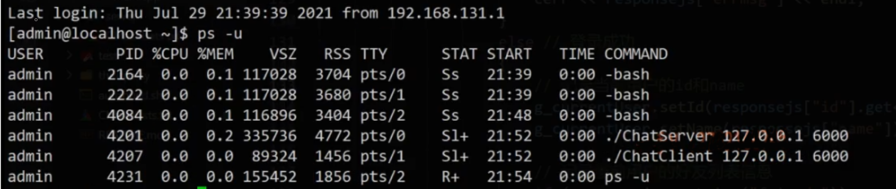
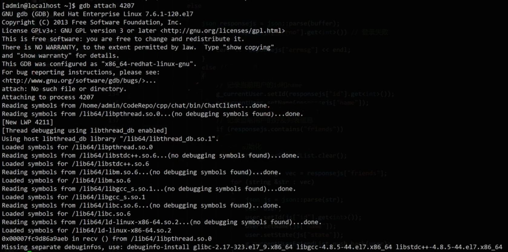
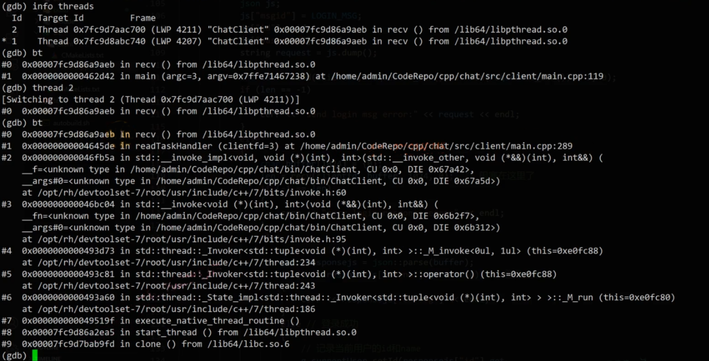

# gdbattach多线程调试方法

---

在遇到程序执行卡住，不继续执行时出现的情况时，由于没有明显的报错信息，无法定位到具体的程序错误位置，且程序的代码量较大，

- 这时可以使用gdb attach来attach到正在运行的进程上，来大致<font color='#BAOC2F'>查看所有运行的线程</font>，以及<font color='#BAOC2F'>线程调用堆栈的详细信息</font>，
- 从而大致能够定位到现在的任务阻塞在哪个位置，

```shell
ps -u
gdb attach pid
info threads #显示当前线程
bt #打印线程堆栈
```








