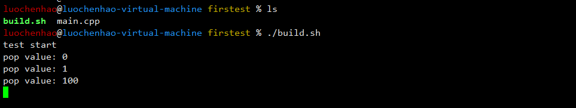
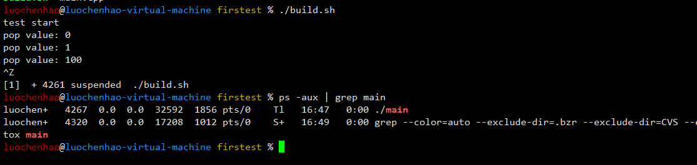
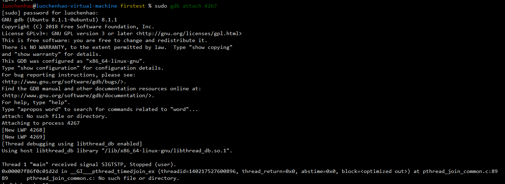
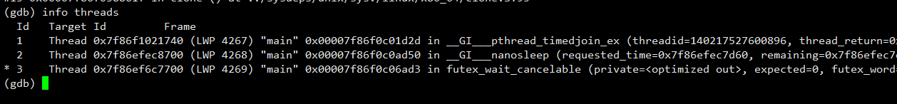
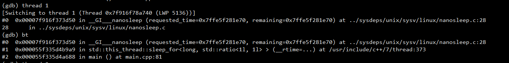
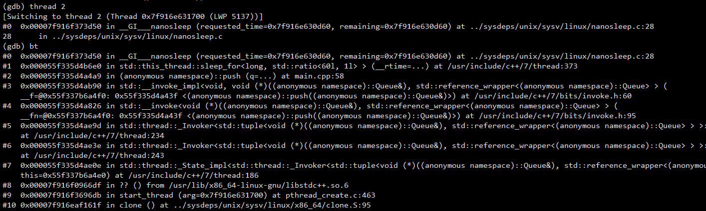
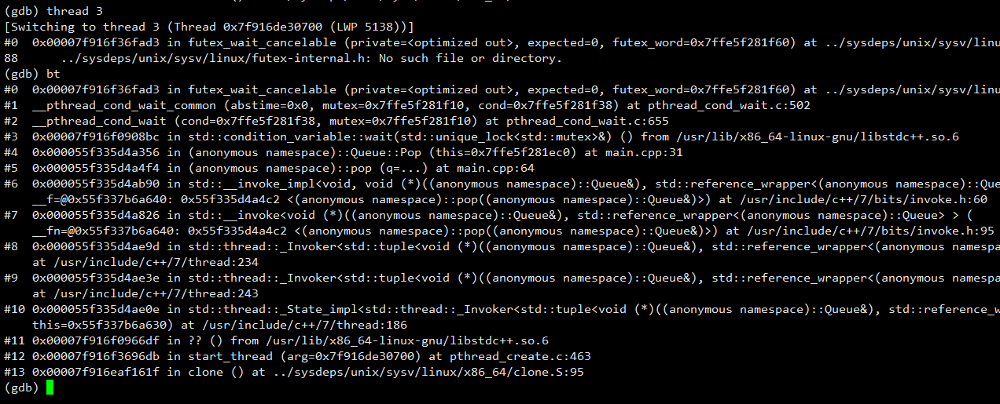

# gdbattach多线程调试方法

---

在Linux上执行有多线程的程序时，当程序执行退出操作时有时会遇到卡死现象，如果程序模块多代码量大很难快速定位，此时可使用gdb attach方法。

在遇到程序执行卡住，不继续执行时出现的情况时，由于没有明显的报错信息，无法定位到具体的程序错误位置，且程序的代码量较大，

- 这时可以使用gdb attach来attach到正在运行的进程上，来大致<font color='#BAOC2F'>查看所有运行的线程</font>，以及<font color='#BAOC2F'>线程调用堆栈的详细信息</font>，
- 从而大致能够定位到现在的任务阻塞在哪个位置，

```shell
ps -u
gdb attach pid
info threads #显示当前进程中的线程
bt #打印线程堆栈
thread id #切换到具体的线程id 一般切换到具体的线程后再执行bt等操作
```

### 程序实例

测试代码main.cpp如下，这里为了使程序退出时产生卡死现象，在第51行时push线程sleep 100分钟：

```cpp
#include <stdio.h>
#include <thread>
#include <queue>
#include <mutex>
#include <condition_variable>
#include <chrono>
 
namespace {

class Queue {
public:
	Queue() = default;
	~Queue() { }
 
	void Init(int num) {
		for (int i = 0; i < num; ++i) {
			queue_.push(i);
		}
	}
 
	int Pop() {
		std::unique_lock<std::mutex> lck(mutex_);
		while (queue_.size() == 0) {
			cv_.wait(lck);
		}
 
		int value = queue_.front();
		queue_.pop();
 
		return value;
	}
 
	void Push(int value) {
		std::unique_lock<std::mutex> lck(mutex_);
		queue_.push(value);
		cv_.notify_all();
	}
 
private:
	std::queue<int> queue_;
	std::mutex mutex_;
	std::condition_variable cv_;	
}; // class Queue
 
bool running = false;
 
void push(Queue& q) {
	int value = 100;
	while (running) {
		q.Push(value++);
		std::this_thread::sleep_for(std::chrono::minutes(100));
	}
}
 
void pop(Queue& q) {
	while (running) {
		fprintf(stdout, "pop value: %d\n", q.Pop());
		std::this_thread::sleep_for(std::chrono::seconds(1));
	}
}
 
} // namespace
 
int main() {
	fprintf(stdout, "test start\n");
    
	Queue q;
	q.Init(2);
 
	running = true;
	std::thread th1(push, std::ref(q));
	std::thread th2(pop, std::ref(q));
 
	std::this_thread::sleep_for(std::chrono::seconds(10));
	running = false;
	th1.join();
	th2.join();
 
	fprintf(stdout, "test end\n");
	return 0;
}
```

build.sh脚本内容如下：

```
g++ -g -std=c++11 -o main main.cpp -lpthread
./main
```

执行`./build.sh`执行结果如下，程序无法正常退出，产生卡死现象



### 开始调试

- step1：`ps -aux | grep main`获取到main进程的pid：4267



- step2：启动gdb attach，执行`gdb attach pid`即可调试正在运行的程序`gdb attach 4267`



- step3：执行`info threads`，查看当前进程下的所有线程，当前线程id是1，即主线程



- step4：执行`bt`命令，查看当前线程堆栈

首先执行info threads，发现共有3个线程，当前线程id是1，即主线程，执行bt，会发现程序卡在第81行，即th1.join()语句上，即在push函数内没有退出。

执行thread 2，再执行bt，发现此线程在执行push函数，卡在了第58行的`std::this_thread::sleep_for(std::chrono::minutes(100));`语句上。

执行thread 3，再执行bt，发现此线程在执行pop函数，卡在了第31行的`cv_.wait(lck)`语句上，分析完成，

了解了程序卡死的原因，执行结果如下图所示：








