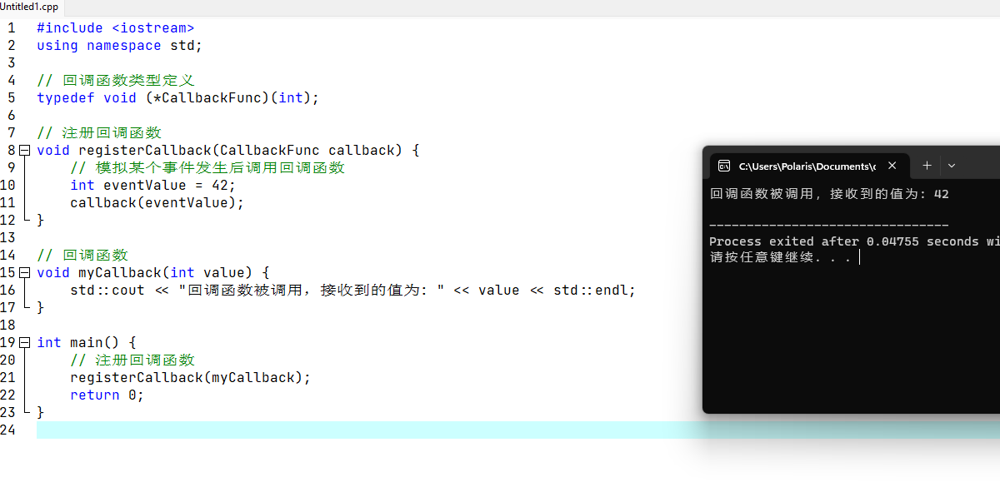

# 关于事件回调机制

---

### 1.事件回调编程模式

当涉及到编程和软件开发时，<font color='#BAOC2F'>事件回调</font>是一种常见的编程模式。它<font color='#BAOC2F'>用于处理异步事件和消息传递系统中的事件通知</font>。

事件回调的基本概念是，在某个特定事件发生时，系统会调用预先定义好的函数（即回调函数）来处理该事件。<font color='#BAOC2F'>回调函数通常作为参数传递给触发事件的函数</font>或者<font color='#BAOC2F'>注册到事件处理器中</font>。

下面是事件回调的一般工作流程：

1. 注册回调函数：在需要监听特定事件的地方，开发者将一个函数注册为事件的回调函数。这通常是通过将<font color='#BAOC2F'>函数指针</font>或<font color='#BAOC2F'>函数引用</font>作为参数<font color='#BAOC2F'>传递给一个注册函数</font>或<font color='#BAOC2F'>设置一个特定属性</font>来实现的。
2. 触发事件：当某个事件发生时（比如按钮被点击、数据加载完成等），相应的代码或系统将触发该事件。
3. 调用回调函数：一旦事件被触发，系统将调用事先注册的回调函数，并<font color='#BAOC2F'>将事件的相关数据作为参数</font>传递给回调函数。
4. 执行回调函数：回调函数将被执行，它会处理接收到的事件数据，并执行相应的逻辑、操作或者回馈。

通过使用事件回调，开发者可以实现<font color='#BAOC2F'>异步编程模型</font>，允许<font color='#BAOC2F'>程序在事件发生时采取相应的动作，而不必等待事件的完成</font>。这对于<font color='#BAOC2F'>处理大量的并发任务</font>或<font color='#BAOC2F'>需要响应用户交互的应用程序</font>非常有用。

### 2.C++中的事件回调编程模式

在C++中，回调函数通常通过<font color='#BAOC2F'>函数指针</font>或<font color='#BAOC2F'>函数对象</font>来实现。以下是两种常见的回调函数实现方式：回调函数有两种实现方式，函数指针回调与函数对象回调，

通过函数指针或函数对象实现回调函数时，可以根据需要传递参数，并在回调函数中执行相应的逻辑。

这种方式允许C++开发者<font color='#BAOC2F'>将函数作为参数传递</font>，并<font color='#BAOC2F'>在运行时动态确定调用哪个函数</font>，从而实现灵活的回调机制。

#### 函数指针回调

1. 定义函数指针：首先，定义一个函数指针类型，该类型与回调函数具有<font color='#BAOC2F'>相同的签名</font>（参数列表和返回类型）
2. 注册回调函数：在需要<font color='#BAOC2F'>注册回调函数的地方</font>，将回调函数的<font color='#BAOC2F'>指针</font>传递给<font color='#BAOC2F'>接收回调函数指针的函数或对象</font>，以完成注册。
3. 调用回调函数：当特定事件发生时，调用注册的回调函数指针，传递所需的参数。

```cpp
// 1.定义回调函数指针类型
typedef void (*CallbackFunc)(int);

// 2.注册回调函数
void registerCallback(CallbackFunc callback) {
    // ...
}

// 回调函数
void myCallback(int value) {
    // 处理回调逻辑
}

int main() {
    // 注册回调函数
    registerCallback(myCallback);

    // 3.触发事件并调用回调函数
    // ...
}
```


#### 函数对象回调

1. 定义函数对象：创建一个函数对象类，其中包含一个重载的函数调用运算符（`operator()`），以便可以像调用函数一样调用该对象。
2. 注册回调函数：在需要注册回调函数的地方，将函数对象实例传递给接收回调函数对象的函数或对象。
3. 调用回调函数：当特定事件发生时，调用注册的函数对象，传递所需的参数。

```cpp
// 1.定义回调函数对象类
class MyCallback {
public:
    void operator()(int value) {
        // 处理回调逻辑
    }
};

// 2.注册回调函数对象
void registerCallback(const MyCallback& callback) {
    // ...
}

int main() {
    // 创建回调函数对象实例
    MyCallback myCallback;

    // 注册回调函数对象
    registerCallback(myCallback);

    // 3.触发事件并调用回调函数对象
    // ...
}
```

### 3.简单回调实例

使用C++编写回调函数时，一种常见的场景是使用函数指针作为回调机制。以下是一个简单的示例程序，演示了如何使用函数指针实现回调：

```cpp
#include <iostream>

// 回调函数类型定义
typedef void (*CallbackFunc)(int);

// 注册回调函数
void registerCallback(CallbackFunc callback) {
    // 模拟某个事件发生后调用回调函数
    int eventValue = 42;
    callback(eventValue);
}

// 回调函数
void myCallback(int value) {
    std::cout << "回调函数被调用，接收到的值为: " << value << std::endl;
}

int main() {
    // 注册回调函数
    registerCallback(myCallback);
    return 0;
}
```

1. 在这个示例中，首先定义了回调函数类型CallbackFunc，它是一个指向返回类型为void、参数为int的函数指针。
2. 然后我们实现了registerCallback函数，它接受一个回调函数指针作为参数，并模拟某个事件的发生。在registerCallback函数内部，我们使用一个假设的事件值调用回调函数指针。
3. 在main函数中，我们定义了名为myCallback的回调函数，它接收一个int类型的值，并在控制台上打印该值。
4. 然后，我们调用registerCallback函数，将myCallback函数的指针作为参数传递进去。当事件发生时registerCallback函数内部会调用回调函数指针，触发myCallback函数的执行。




